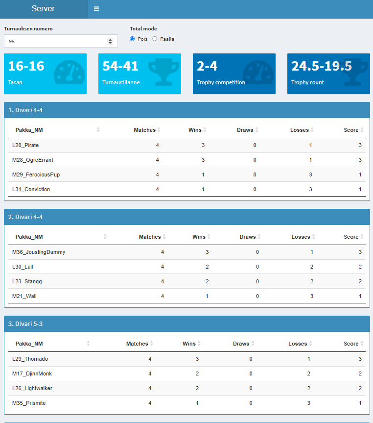
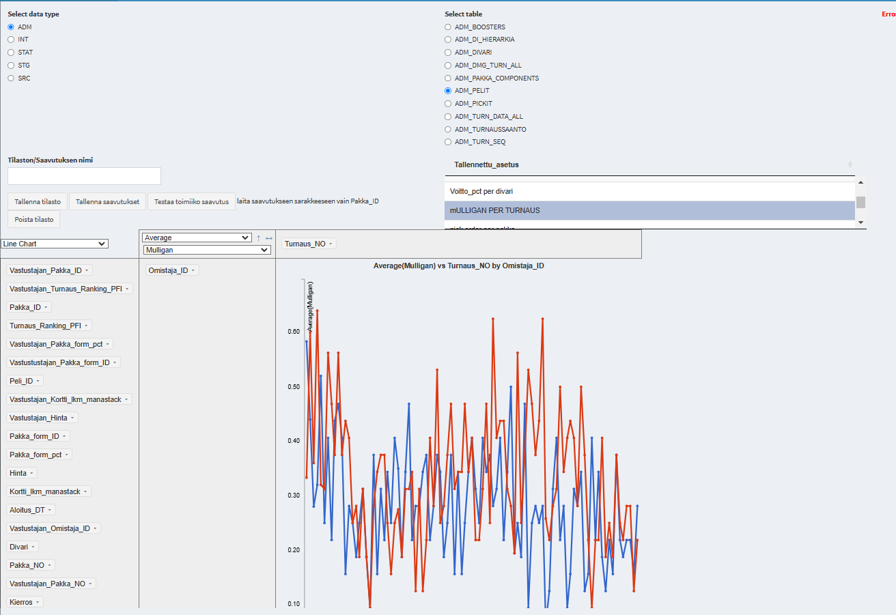

# Project Name
Mätkysofta and in english "Magic the Gathering Software"
# Introduction
Core component of the tool that handles database input/ouput. Receives results from life counter apps. Calculates and visualizes statistics based on the results.
# Standings sheet

# Statistics tool

